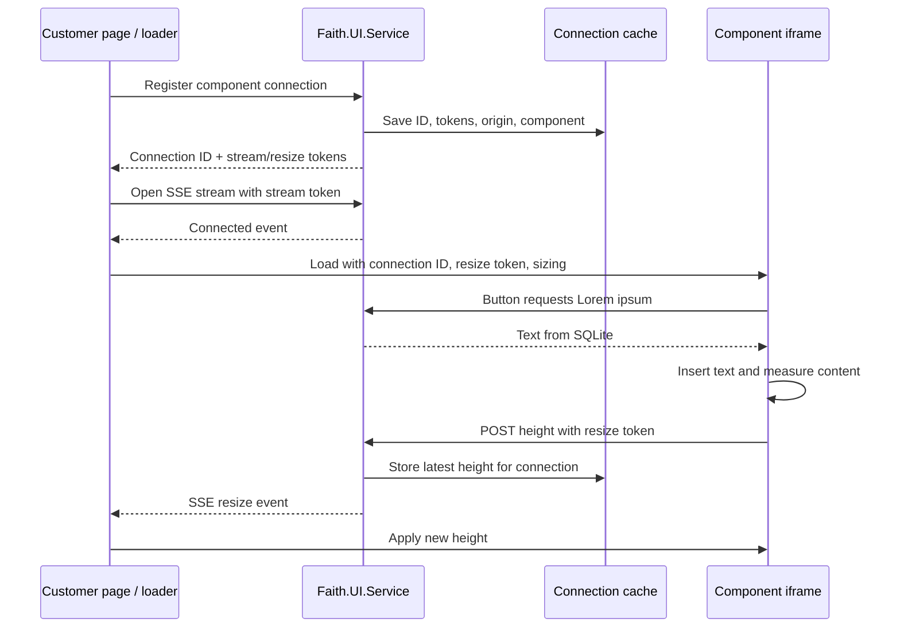

# Faith.UI

A standalone component-service proof of concept adapted from the Sample Site. The active solution has no Branches dependencies, PWA, or Android projects. It contains one version of each sample component.

## Start locally

Requires .NET SDK 10.0.400 or a compatible 10.0.4xx patch, PowerShell 7.2+, and Node.js. Trust the ASP.NET development HTTPS certificate if needed with `dotnet dev-certs https --trust`.

```powershell
./scripts/build.ps1 -Target Service
./scripts/run-demo.ps1
```

- **Component catalog:** https://localhost:7241
- **Component summaries:** `/components/a`, `/components/b`, `/components/c`
- **Standalone HTML demos:** `/examples/a.html`, `/examples/b.html`, `/examples/c.html`
- **Independent HTML host:** http://localhost:5242 or http://127.0.0.1:5242

Each catalog entry links to its summary, HTML demo, direct control, and generated embed code. A, B, and C intentionally share the same basic button-and-response implementation, with separate URLs ready for future components.

Click **Add Lorem ipsum** to fetch a paragraph from local SQLite. The iframe grows around the response. **Clear text** shrinks it again. **Wide** and **Compact** demonstrate responsive reflow.

Stop the demo with Ctrl+C or create `artifacts/demo.stop`. The Windows launcher owns both servers and verifies descendant cleanup. `-RunSeconds 120` provides a bounded run. To launch separately, use `./scripts/run.ps1` for the service and `node samples/embed-host/serve.mjs` for the independent HTML host.

## Projects

| Active project | Responsibility |
| --- | --- |
| `Faith.UI.Service` | Runnable web service, catalog, component pages, HTML demos, connection API, and SSE streams |
| `Faith.UI` | Reusable Razor control and JavaScript loader/helper |
| `Faith.UI.Logic` | Local SQLite sample-text storage |
| `Faith.UI.Tests` | One minimal SQLite initialization/read check |

Open **`Faith.UI.slnx`**. The service has its own project file at `src/Faith.UI.Service/Faith.UI.Service.csproj`.

Inherited application source remains preserved outside the active solution or explicitly excluded from compilation/content. It is not a dependency of this first pass. The active Razor library includes only `Embedding/`, `_Imports.razor`, and the three embed assets. The active logic library compiles only `SampleTextStore.cs`.

## JavaScript integration

```html
<div id="faith-a"></div>
<script src="https://localhost:7241/_content/Faith.UI/faith-ui.js"></script>
<script>
  const widget = Faith.UI.mount("#faith-a", {
    endpoint: "https://localhost:7241/embed/a",
    initialHeight: 280,
    minHeight: 120,
    maxHeight: 2400
  });
  widget.ready.catch(error => console.error(error.message));
</script>
```

`Faith.UI.getEmbedCode("a")` generates this snippet using the service origin. Use `"b"` or `"c"` for the other components. Each summary page displays it with a Copy code button.

The iframe fills the container width. Sizes are CSS pixels. `widget.ready` resolves after the first height arrives through SSE; it rejects if loading does not complete within 15 seconds. `widget.destroy()` closes the stream, releases the connection, and removes the iframe. The container emits `faithui:resize` with `connectionId`, `height`, `contentHeight`, and `capped` in `event.detail`.

## Connection and resizing flow

The parent loader first registers a connection. The service caches a random connection ID, separate stream/resize tokens, the parent origin, and component ID. The parent opens an EventSource stream with its stream token. Once connected, it loads the iframe with the connection ID, resize token, and initial sizing requirements.

The iframe measures its content using `ResizeObserver` and POSTs the height to the service with its resize token. The service forwards that height over the parent's SSE stream. The parent applies its configured height limits; excess content scrolls. There is no direct postMessage sizing path.



Connections use an in-memory cache with a 1,000-entry limit and expire after 30 minutes idle. Active streams receive 15-second heartbeats; reconnecting streams receive the latest height. Closing a widget explicitly releases its connection. A service restart clears the cache, so reload demo pages afterward. This first pass runs as one service instance.

## SQLite and hosting

The local database is **`src/Faith.UI.Service/App_Data/faith-ui.db`**. Startup creates a sample-response table and seeds the Lorem ipsum paragraph if missing. Added paragraphs live in the browser until cleared or reloaded. Configure `Storage:Root` to relocate the database. Local data and build outputs are ignored.

Development permits the two local independent HTML origins. Production permits no external origins until `Embed:AllowedOrigins` is configured with exact origins, without paths or trailing slashes. The same list drives CORS and the embedded document's CSP `frame-ancestors`. Same-origin demos also work.

```json
{
  "Embed": { "AllowedOrigins": ["https://customer.example"] }
}
```

Use the service's deployed origin in embed snippets. A customer site's CSP needs to permit the loader in `script-src`, the iframe in `frame-src`, and API/SSE requests in `connect-src`. The service assumes hosting at the domain root. The optional Docker configuration persists SQLite under `/data`; no deployment is performed by the demo launcher.

## Minimal verification

`./scripts/build.ps1 -Target Tests` builds the service and runs one SQLite seed/read/reopen check. `-Offline` uses the existing NuGet cache and disables package auditing for that offline run. Builds use one worker and disable persistent build/compiler servers and node reuse.

With the demo running, `node tests/embed-browser.mjs` checks the catalog, separate-origin loading, sizing parameters, button response, SSE resizing, and clearing. It requires Playwright available to Node (locally or through `NODE_PATH`) and Microsoft Edge. The test closes its browser and writes results/screenshots under `artifacts/`. Only its isolated browser context accepts the local development certificate without trust.

See `VALIDATION.md` for results.
